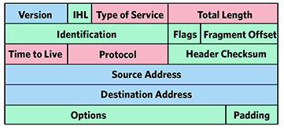

---
tags:
  - slide
theme: gaia
paginate: true
marp: true
style: |
  .columns {
    display: grid;
    grid-template-columns: repeat(2, minmax(0, 1fr));
    gap: 1rem;
  }
---
# Semestrální práce:
## Kontrolní součty (MD5 a jiné) a jejich použití

Předmět: KAS - Kybernetická bezpečnost a šifrování
Datum: 29. 11. 2023
Autor: Jaroslav Körner

---
## Kontrolní součty
### 32-Sum
1) Rozdělí zprávu na $n * 32b$.
2) Inicializujeme akumulátor na "$0$".
3) Aplikuje se "$sum()$" a "$mod(32)$".
4) Opakujeme krok 2 dokud nezpracujeme celou zprávu.
5) Určíme **dvojkový doplněk** (inverzní prvek pro sčítání).
6) Příjemce po přičtení všech přijatých slov získá $0$.
---
## Aplikace kontrolních součtů
- **Btrfs**, **Ext4**,
- **Ethernet** (IEEE 802.3), **SCTP**, **SATA**,  **iSCSI**
- **ISBN-10**, **EAN-13**, **Bzip2**, **Zip**, **Gzip**, **PNG**, **MPEG-2**

---
## Hash
- Královnina zpráva:
1. "Jsem těhotná asi s kočím z Mostu. Královna"
2. "Jsem těhotná, asi skočím z mostu. Královna"
- MD5 otisky:
1. `3c723007c372b83ea3e28161f174dbdf`
2. `04005f28f6f6bed78a8a316df66a07f7`

---
## MD5

1. Inicializace akumulátorů.
2. Funkcemi využívajících operace `XOR`.
3. Netriviální proházení bitů.
4. Hodnoty se přičtou do akumulátorů.
5. Zpět na krok 2. dokud se vše nezpracuje.
6. Akumulatory se zřetězí na výstup (128b otisk).

	 
	<code>
		word A: 01 23 45 67  
		word B: 89 ab cd ef  
		word C: fe dc ba 98  
		word D: 76 54 32 10  
	</code>
	   
	<code>
		F(X,Y,Z) = XY v not(X) Z  
		G(X,Y,Z) = XZ v Y not(Z)  
		H(X,Y,Z) = X xor Y xor Z  
		I(X,Y,Z) = Y xor (X v not(Z))  
	</code>
	

---
## Použití:
- autenticita souborů při internetové komunikaci
- ochrana proti chybě přenosu:
	- nespolehlivým médiem (kontrolní součet)
	- úmyslné záměně souborů (otisk hashovací funkce)

- ukládání hesel (kryptografické hashovací funkce)
- asociativní vyhledávání v datech

---
## Zdroje:
- [Miroslav Němeček - Kontrolní součty a jejich výpočty v C](http://www.breatharian.eu/sw/crc/index.html)
- [Lukas Hron - kontrolni soucet checksum](https://www.lukashron.cz/kontrolni-soucet-checksum.html)
- [Computerphile: Hashing Algorithms and Security](https://www.youtube.com/watch?v=b4b8ktEV4Bg)
- [googlesource: crc32](https://fuchsia.googlesource.com/third_party/wuffs/+/HEAD/std/crc32/README.md)
- [EAN13Barcode](https://www.technoriversoft.com/EAN13Barcode.html)
- [rfc: Rivest-MD5](https://datatracker.ietf.org/doc/html/rfc1321)
- [rfc: ISBN](https://datatracker.ietf.org/doc/html/rfc3187)
- [rfc: Computing the Internet Checksum](https://datatracker.ietf.org/doc/html/rfc1071)

---
## Otázky
- [DALL-E](https://labs.openai.com)
- [IPv4](https://blog.apnic.net/2018/06/18/a-closer-look-at-ip-headers/)

---
## Děkuji za pozornost